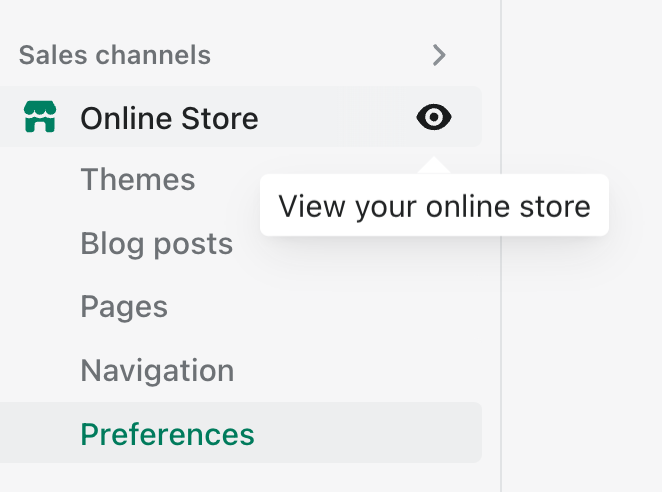
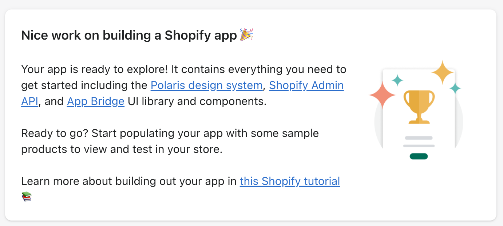
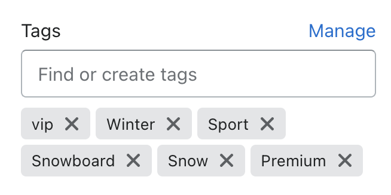

summary: Things you need to do first.
id: prerequisites
status: Published
categories: prerequisites
feedback-link: https://github.com/nickwesselman/polyglot-functions/issues

# ** Prerequisites: Partner account, development shop, and app creation

## Create a Shopify partner account

You can [sign up for a Partner account](https://partners.shopify.com/signup) on partners.shopify.com. If you already have a Shopify partner account and organization that you can use for this workshop, you can skip this.

## Create a development store

1. From the Shopify Partners portal, navigate to **Stores** > **Add store** > **Create development store**.
2. It's important for this workshop that you select the correct options when creating your store:

    - For **Development store use**, select **Create a store to test and build**.
    - You may use whatever Store Name you like.
    - For **Which build do you want to test?**, select **Developer Preview** > **Checkout Extensibility**.
    - For **Data and configurations**, select **Start with test data**.

3. After creating your development store, the store admin will open. Hover over the **Online Store** sales channel and click the 👁️ icon to open your store.



## Create and install an app

1. Ensure you have a [recent version of Node.js](https://nodejs.org/en/download/) installed.
1. Use the following command to create a copy of the app we will be using for this workshop:

    ```bash
    npm init @shopify/app@pre -- --template https://github.com/nickwesselman/polyglot-functions --name polyglot-functions
    ```

1. This will create an app in a folder called `polyglot-functions`. Navigate into it.

    ```bash
    cd polyglot-functions
    ```

1. Delete the completed functions in the `extensions` folder -- no cheating. 😇

    ```bash
    rm -rf extensions
    ```

1. Start the app development mode and follow the prompts:

    ```bash
    npm run dev
    ```

    - Open Partners and log in, if prompted.
    - Select the correct partner organization, if prompted.
    - When asked, _Create this project as a new app on Shopify?_, select **Yes**.
    - Keep the default app name, `polyglot-functions`.
    - If asked, _Which store would you like to use to view your project?_, select the store created in the previous step.
    - If asked, _Have Shopify automatically update your app's URL?_, select **Always**.

1. Once your app is running and logs are streaming, press **p** to open your browser, or copy/paste the provided **Preview URL**.
1. The app installation page will open. Click **Install app**.

You should see the home page of the app:



## Set up additional test data

You're doing great! For this workshop, the discount logic we will be implementing in each language is:

<<include/function-logic.md>>

But first, you will need to ensure that your store has a customer and products that meet these requirements. The app you just installed added a customer **metafield**. Metafields are custom data fields that stores and apps can add to various domain objects in Shopify.

1. In your store admin, navigate to **Customers** > **Karine Ruby**.
1. Under **Metafields**, click **Show all**.
1. For **VIP Customer**, select **True**.
1. Click **Save**.

Next, let's add the needed tag to a product.

1. Still in your store admin, navigate to **Products** > **The Complete Snowboard**.
1. In the right column, under **Tags**, add **vip**.
1. Click **Save**.



## That's it!

Nice work. If you like, you can go back to your online store. If this is a group workshop, you can explore the products and checkout process while everyone else finishes!